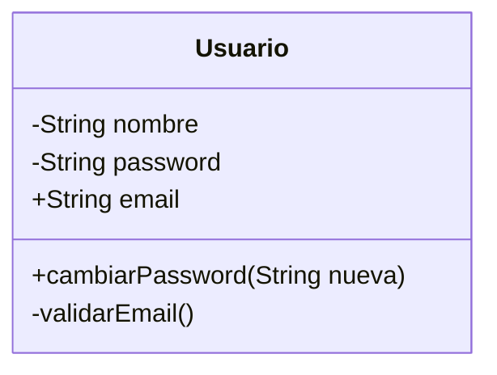

# Ejercicio 1: Usuario de Streaming

## Diagrama de Clases

```mermaid
classDiagram
    class Usuario {
        -String nombre
        -String password
        +String email
        +cambiarPassword(String nueva)
        -validarEmail()
    }
```
