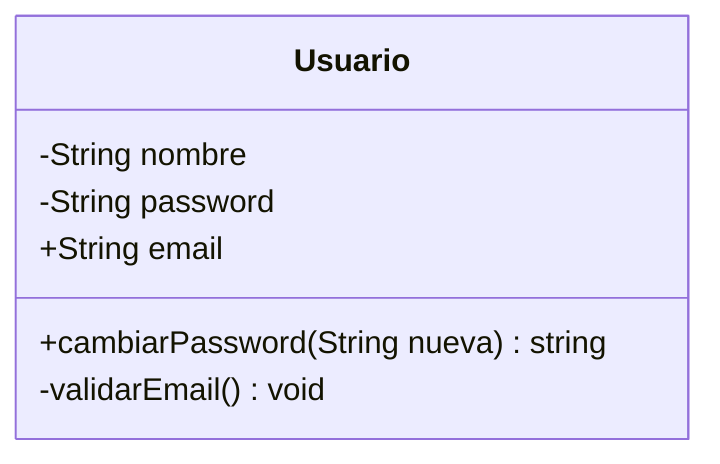
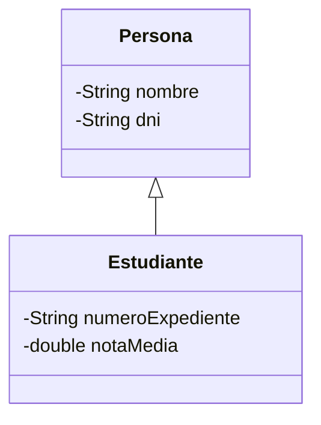
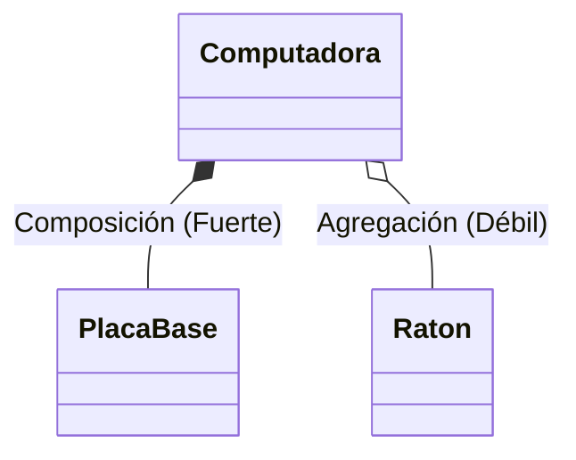
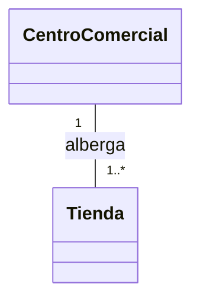
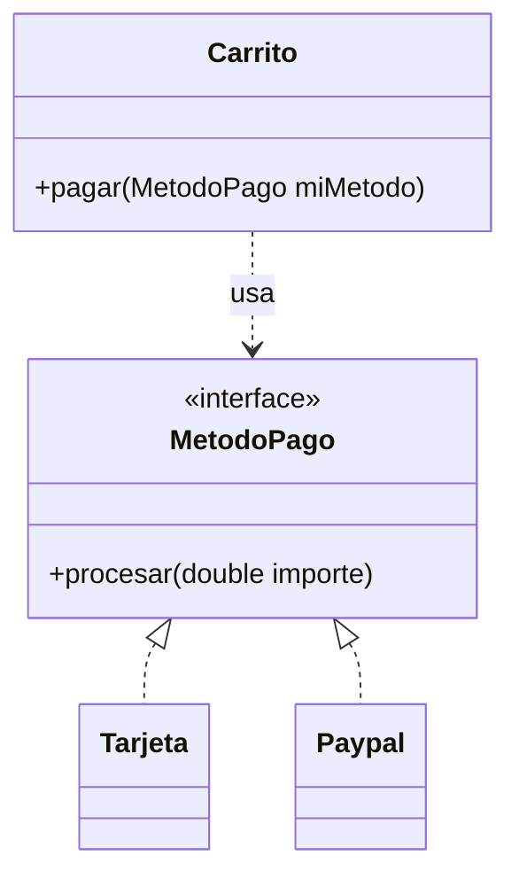

# Ejercicio 1: Usuario de Streaming

## Diagrama de Clases

# Ejercicio 2: Sistema Escolar

## Diagrama de Clases

# Ejercicio 3: Computadora

## Diagrama de Clases

# Ejercicio 4: Centro Comercial

## Diagrama de Clases

# Ejercicio 5: Sistema de Pagos

## Diagrama de Clases

