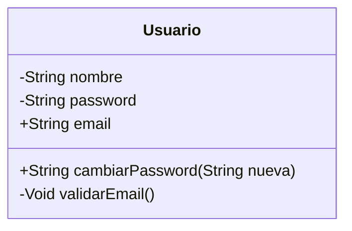
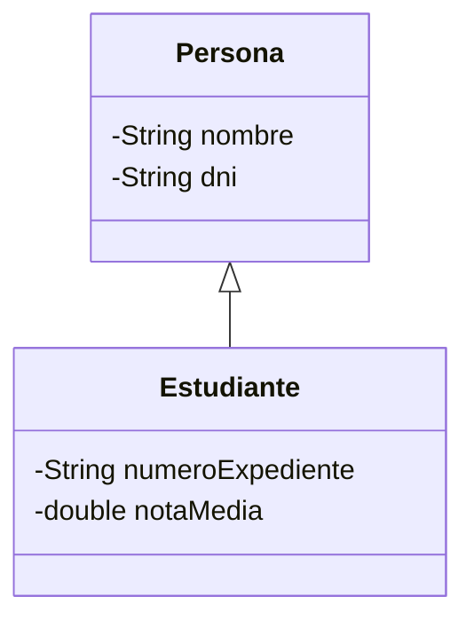

# Ejercicio 1: Usuario de Streaming

## Diagrama de Clases

```mermaid
classDiagram
    class Usuario {
        -String nombre
        -String password
        +String email
        +String cambiarPassword(String nueva)
        -Void validarEmail()
    }
```

# Ejercicio 2: Sistema Escolar

## Diagrama de Clases

```mermaid
classDiagram
    class Persona {
        -String nombre
        -String dni
    }
    class Estudiante {
        -String numeroExpediente
        -double notaMedia
    }
    Persona <|-- Estudiante
```

